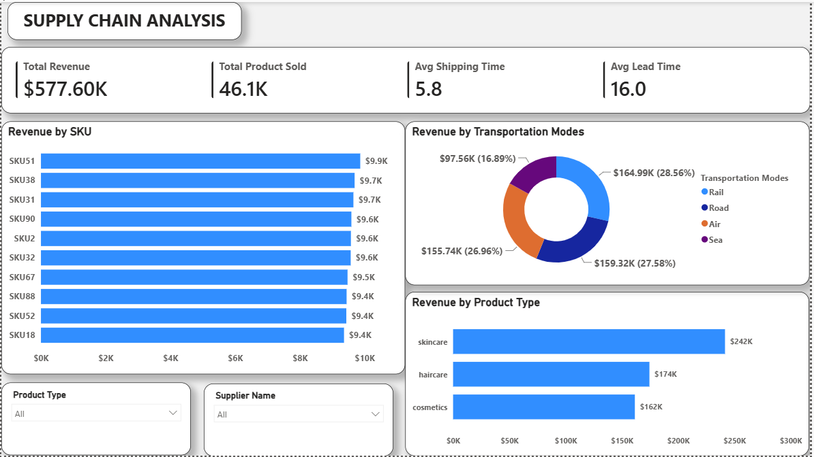
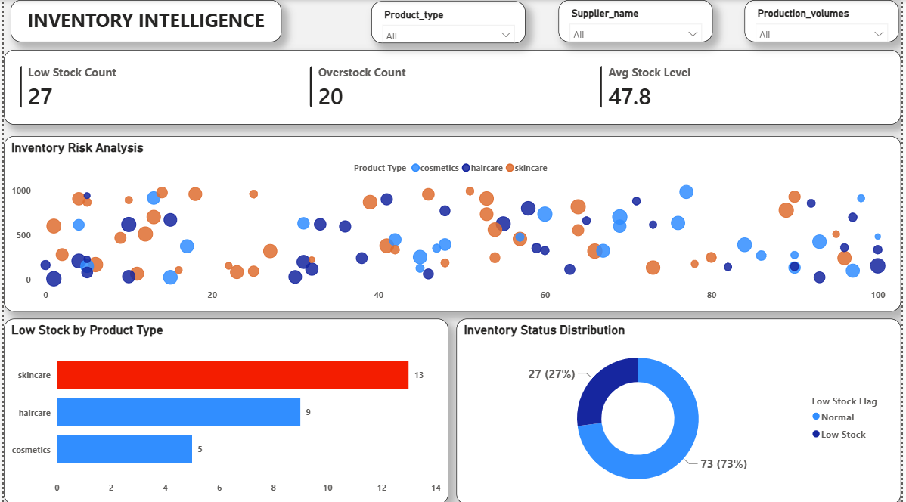
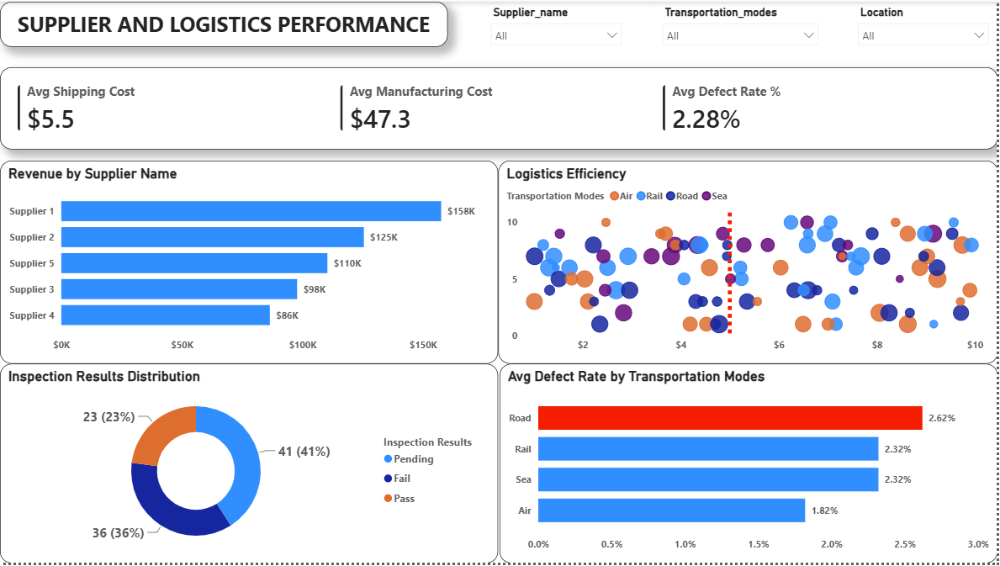

# 📦 Supply Chain Analytics Dashboard (Power BI)

## 📌 Project Overview

This project analyzes supply chain operations, inventory performance, supplier efficiency, transportation methods, and revenue generation.

Using Power BI, the dashboard provides actionable insights into product performance, inventory risks, logistics efficiency, supplier contribution, and transportation effectiveness to support data-driven supply chain decisions.

---

## 🎯 Business Problem

Supply chain teams need visibility into:

- Which products generate the most revenue
- Inventory items at risk of stock shortages
- Supplier performance and reliability
- Transportation efficiency
- Lead time and shipping delays
- Revenue contribution across product categories

Without clear insights, organizations risk stockouts, delayed deliveries, excess inventory costs, and reduced profitability.

---

## 📊 Dashboard Structure

### Page 1: Supply Chain Overview

Focuses on:

- Revenue performance
- Product sales performance
- Transportation mode contribution
- Product category revenue
- Supply chain KPIs

Key visuals include:

- Revenue by SKU
- Revenue by Transportation Mode
- Revenue by Product Type
- KPI Cards

### 📸 Supply Chain Overview

---

## 📦 Page 2: Inventory Intelligence

Focuses on:

- Inventory health
- Stock availability
- Low stock identification
- Product demand analysis
- Inventory risk monitoring

Key visuals include:

- Low Stock Products
- Inventory Levels by Product Type
- Stock Distribution Analysis
- Demand Monitoring

### 📸 Inventory Intelligence

---

## 🚚 Page 3: Supply & Logistics Performance

Focuses on:

- Supplier performance
- Transportation effectiveness
- Lead time analysis
- Shipping performance
- Logistics efficiency

Key visuals include:

- Supplier Performance Analysis
- Lead Time Comparison
- Shipping Time Analysis
- Logistics KPIs

### 📸 Supply & Logistics Performance

---

## 🔍 Key Business Insights

### 1. Skincare Products Generate the Highest Revenue

Skincare products contribute the largest share of revenue compared to haircare and cosmetics products.

### 2. Revenue Is Distributed Across Multiple Transportation Methods

Rail, Road, Air, and Sea transportation all contribute significantly to revenue generation, indicating diversified logistics operations.

### 3. Certain SKUs Significantly Outperform Others

A small number of SKUs generate the highest revenue and should receive priority inventory planning.

### 4. Inventory Monitoring Is Critical

Low-stock products can create fulfillment risks and negatively impact customer satisfaction if not replenished promptly.

### 5. Lead Time Directly Impacts Supply Chain Efficiency

Long lead times may increase stockout risk and reduce operational responsiveness.

---

## 💡 Recommendations

### Inventory Management

- Increase monitoring of low-stock products.
- Establish reorder thresholds for critical SKUs.
- Improve demand forecasting accuracy.

### Supplier Optimization

- Prioritize high-performing suppliers.
- Review suppliers with long lead times.
- Develop backup supplier relationships for critical products.

### Logistics Improvement

- Optimize transportation allocation based on cost and performance.
- Reduce shipping delays through route analysis.
- Continuously monitor logistics KPIs.

### Revenue Growth

- Focus inventory investments on high-performing product categories.
- Ensure top-selling SKUs remain adequately stocked.
- Expand successful product lines where demand is strongest.

---

## 🛠 Tools Used

- Power BI
- Power Query
- DAX
- Data Modeling
- Interactive Dashboards
- Data Visualization

---

## 📈 Skills Demonstrated

- Supply Chain Analytics
- Inventory Analysis
- Logistics Performance Analysis
- KPI Development
- Data Modeling
- DAX Measures
- Business Intelligence
- Data Storytelling
- Dashboard Design
- Business Recommendations

---

## 📁 Repository Contents

- Supply Chain Analytics project.pbix
- README.md
- ExecutiveOverview.png
- InventoryIntelligence.png
- LogisticsPerformance.png

---

## 🚀 Outcome

This dashboard helps supply chain managers identify inventory risks, monitor supplier performance, evaluate logistics efficiency, and improve overall operational decision-making through data-driven insights.
